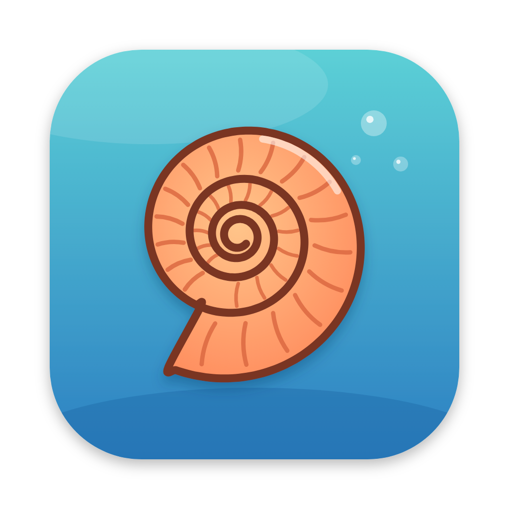

<p align="center">
  
</p>

<p align="center">
  
</p>

<p align="center">
  <em>A spiral of knowledge for your PDF library.</em><br>
</p>

## Features

- Manage a local library of PDFs.
- PDF annotations (compatible with Skim).
- Markdown notes.
- Tags.
- File editor for .md, .tex and .bib files (File › Open File… / Open Folder…), with a live Markdown preview side by side.
- LaTeX: compile with latexmk (⌘B), errors and warnings linked to the source, SyncTeX (⌘-click from the source to the PDF and back). Requires MacTeX or TeX Live.
- AI: ask questions, summaries, tagging, related work, audio, ...
- Metadata are stored in a .json file along the .pdf file.
- Easy to sync via gdrive or git.
- Markdown and LaTeX file editor.

## Getting started

```sh
npm install      # requires node.js
npm start        # builds into dist/ and launches Electron
```

On first launch, choose one or more library folders and the AI command-line tools you authorize.
Settings are saved in `~/omoeba/config.json`. More folders can be added later in Settings.

## AI

Only AIs with a command-line interface are used, and only those authorized in Settings. Presets:

| AI                 | Command                                                    |
| ------------------ | ---------------------------------------------------------- |
| Claude Code        | `claude -p --output-format text`                           |
| OpenAI Codex       | `codex exec --skip-git-repo-check --sandbox read-only -`   |
| Gemini Antigravity | `agy -p {prompt} --output-format text --print-timeout 15m` |

The prompt is sent on standard input, or in place of `{prompt}` when an argument contains it.


## Development

Built with Electron, TypeScript, pdf.js, KaTeX and CodeMirror.

```sh
npm run watch      # rebuild on change (then reload the window with ⌘R)
npm test           # unit tests (.skim codec, sidecars, search index, …)
npm run typecheck
```
